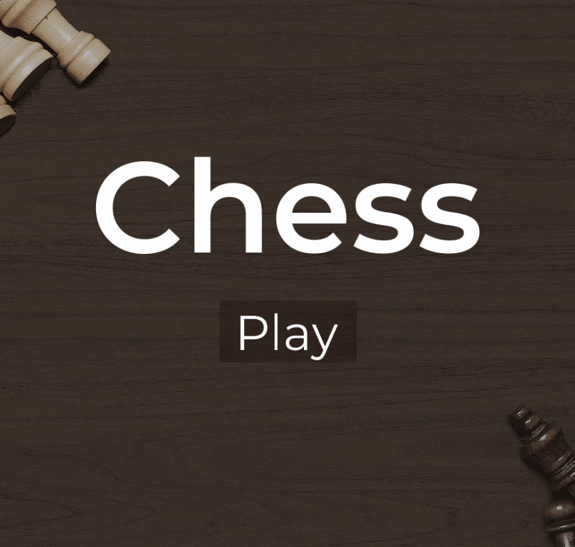

#  chess-opengl

Fully functional chess game written using C and OpenGL with minimal external libraries.



> **DISCLAIMER**: This project was created for fun and to explore OpenGL, so the code can definitely be improved / optimized further.

## Features:
- Supports all the main chess rules, including castling, promotion and En Passant.
- Play with 2 people on the same device.
- Interact with pieces by clicking or dragging.
- Piece movement animations

## Building:
**Note**: The provided Makefile currently only works on Windows. Has been tested with MSYS2/MinGW. Provided libraries in `/lib` are for Windows  x64  MinGW.

- Clone this repository
```
git clone https://github.com/roh1th-s/chess-opengl.git
cd chess-opengl
```
- Build the project using make
```
make
```
- Run
```
"./build/chess"
```

## Directory structure:
- `/src` : Contains the main source code:
	- `/ui` : UI components
	- `/gfx` : Graphics rendering code
	- `/chess` : Main game logic lives here.
	- `main.c` : Entry point
	
- `/res` : Contains project resources (fonts, shaders, textures)

## To-do:
- Improve build system to support more platforms.
- Make UI system more  flexible, remove hardcoded positions/sizes.
- Implement an AI to play against.

## License:
MIT
